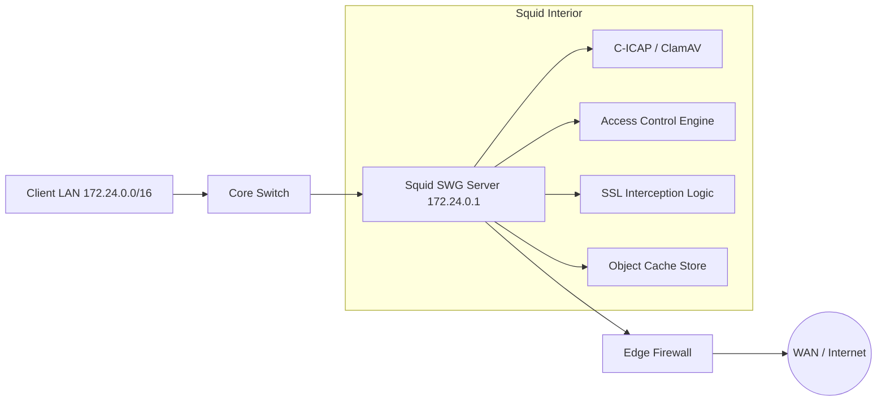

# Squid Proxy & Secure Web Gateway (SWG) Enterprise


[](https://www.squid-cache.org/)
[](https://centos.org/)
[](docker/)
[](Vagrantfile)
[](https://github.com/angkasa760/proyek-Konfigurasi-Server-Proxy-Squid-Kontrol-Akses-Jaringan/actions)
[](LICENSE)

> **Proyek SWG Enterprise-Grade** untuk laboratorium keamanan siber dan infrastruktur jaringan korporat. Konfigurasi ini mentransformasikan server Linux menjadi gateway keamanan canggih yang mampu melakukan inspeksi traffic, pemblokiran ancaman, optimasi bandwidth, dan audit akses jaringan secara real-time.

---

## 🚀 Fitur Utama & Keunggulan Teknis

| Fitur | Deskripsi Teknis | Manfaat |
|---|---|---|
| **Deep Packet Inspection** | Menggunakan fitur **SSL Bump** (Peek & Splice) untuk menjangkau traffic HTTPS. | Deteksi ancaman di traffic terenkripsi tanpa merusak privasi client sepenuhnya. |
| **Real-time Antivirus** | Integrasi **ICAP** dengan ClamAV Scanning Engine melalui engine c-icap. | Deteksi malware pada file yang sedang diunduh secara otomatis. |
| **Granular ACL Logic** | Aturan akses berlapis berdasarkan IP, subnet, domain, kata kunci, hingga tipe file. | Kendali penuh terhadap kebijakan akses internet organisasi. |
| **Bandwidth Management** | Implementasi **Delay Pools** untuk membatasi kecepatan per-client/IP. | Mencegah "monopoli" bandwidth oleh satu pengguna. |
| **Smart Caching** | Optimasi cache memory dan ufs storage untuk penghematan data. | Mempercepat loading konten statis dan menghemat bandwidth WAN. |
| **Enterprise Auth** | Dukungan autentikasi NCSA (Basic) dan integrasi LDAP. | Sinkronisasi hak akses dengan database user perusahaan. |

---

## 🏗️ Arsitektur Jaringan (Enterprise SWG Model)

Model deployment gateway tunggal memastikan tidak ada "backdoor" atau bypass traffic yang tidak terdeteksi.



---

## 🛠️ Master Deployment Guide: Step-by-Step

Panduan komprehensif dari instalasi OS hingga fitur lanjutan.

### 1. Persiapan Sistem (CentOS 7)
Proxy ini dioptimalkan untuk CentOS 7. Pastikan sistem memiliki akses internet untuk unduhan awal.
```bash
# Update sistem dan install tools esensial
sudo yum update -y && sudo yum install -y git wget curl net-tools
```

### 2. Instalasi & Service Core
Gunakan script otomatis kami untuk instalasi standar yang bersih:
```bash
git clone https://github.com/angkasa760/proyek-Konfigurasi-Server-Proxy-Squid-Kontrol-Akses-Jaringan.git
cd proyek-Konfigurasi-Server-Proxy-Squid-Kontrol-Akses-Jaringan
chmod +x scripts/*.sh
sudo ./scripts/install_and_service.sh
```

### 3. Konfigurasi Access Control (ACL)
Sesuaikan blocklist domain dan keyword untuk keamanan jaringan:
```bash
# Tambahkan domain yang diblokir ke file ini
sudo nano configs/squid/blocked_sites.txt

# Sync konfigurasi ke sistem
sudo cp configs/squid/squid.conf /etc/squid/squid.conf
sudo squid -k parse && sudo systemctl restart squid
```

### 4. Implementasi SSL Inspection (HTTPS Bump)
Langkah kritis untuk menginspeksi traffic HTTPS menggunakan CA Certificate:
```bash
# Jalankan script pembuat CA otomatis
sudo ./scripts/create_ca.sh

# SELESAI: Ambil file /etc/squid/ssl_cert/myCA.crt
# Distribusikan ke client dan import ke browser sebagai 'Trusted Root CA'.
```

### 5. Integrasi Keamanan Anti-Malware (ICAP)
Aktifkan pemindaian virus real-time:
```bash
sudo ./scripts/setup_icap.sh
# Verifikasi c-icap berjalan dengan: netstat -ptln | grep 1344
```

---

## 📁 Struktur Repository & Fungsi Folder

```text
.
├── .github/                 # Integrasi CI/CD (Linting) & Template Kontribusi
├── configs/                 # Repository Konfigurasi
│   ├── squid/               # Template squid.conf, auth, dan blocklists
│   └── firewall/            # Script iptables & hardening CentOS 7
├── scripts/                 # Library Automasi
│   ├── install_and_service.sh  # Deployment inti
│   ├── create_ca.sh            # Manajemen SSL/TLS
│   ├── setup_icap.sh           # Integrasi ClamAV
│   └── health_check.sh         # Dashboard diagnosa sistem
├── docs/                    # Dokumentasi Teknis
│   ├── guides/              # Panduan modul detail (SSL, ICAP, Reporting)
│   └── assets/              # Diagram Topologi dan Branding
├── docker/                  # Portabilitas Lab via Containers
├── Vagrantfile              # Otomasi Lab via VirtualBox
└── README.md                # Gateway Informasi Proyek
```

---

## 🛡️ Security Hardening & Compliance

> [!IMPORTANT]
> **Privasi dan Hukum:** SSL Decryption bersifat invasif. Selalu gunakan whitelisting (`configs/squid/whitelist.txt`) untuk situs perbankan, kesehatan, dan aplikasi sensitif lainnya guna menjaga kepercayaan pengguna dan kepatuhan regulasi.

**Golden Rules:**
- Jangan pernah membagikan `.key` CA Anda.
- Gunakan `scripts/rotate_logs.sh` agar disk log tidak penuh (mencegah DoS).
- Jalankan `scripts/health_check.sh` secara rutin untuk memantau celah keamanan.

---

## 📊 Monitoring & Pelaporan Traffic

Untuk level manajemen, visualisasi traffic sangat krusial:
1. **SARG Reporting**: Membuat laporan harian berbasis web.
2. **Access Log Analysis**: Gunakan `tail -f /var/log/squid/access.log` untuk monitoring live.
3. **Grafana Integration**: (Lihat `docs/guides/monitoring.md`) untuk dashboard real-time yang modern.

---

## 📚 Koleksi Panduan Lengkap (Dalami Teknis)

Klik untuk panduan terperinci setiap modul yang sudah diperbarui:

- 📑 [**Panduan Konfigurasi Client**](docs/guides/client_setup.md) — Setup Windows, Linux & Browser.
- 🧪 [**Verifikasi & Troubleshooting**](docs/guides/verification.md) — Mengatasi error standar dan log analysis.
- ⚡ [**SWG Advanced: SSL & Anti-Malware**](docs/guides/advanced_swg.md) — Penjelasan mendalam SSL Bump & ICAP.
- 🔐 [**Security Hardening Guide**](docs/guides/security_hardening.md) — Mengamankan proxy dari eksploitasi.
- 📊 [**Laporan Traffic (SARG)**](docs/guides/sarg_reporting.md) — Panduan instalasi dan penggunaan SARG.
- ❓ [**FAQ - Solusi Masalah Umum**](docs/guides/faq.md) — Jawaban cepat untuk kendala deployment.

---

## 🤝 Kontribusi & Dukungan

Kami sangat terbuka untuk kontribusi komunitas melalui:
1. **Security Patch**: Laporkan celah keamanan via GitHub Issues.
2. **Optimization**: Usulkan performa config yang lebih kencang.
3. **Documentation**: Perjelas bagian yang mungkin sulit dimengerti.

Silakan baca [Panduan Kontribusi](.github/PULL_REQUEST_TEMPLATE.md) sebelum melakukan Pull Request.

---

Dikembangkan sebagai proyek lab **Konfigurasi Jaringan & Keamanan Siber** dengan standar industri.

© 2026 **angkasa760** | *Enterprise Network Engineering Lab* | **MIT License**